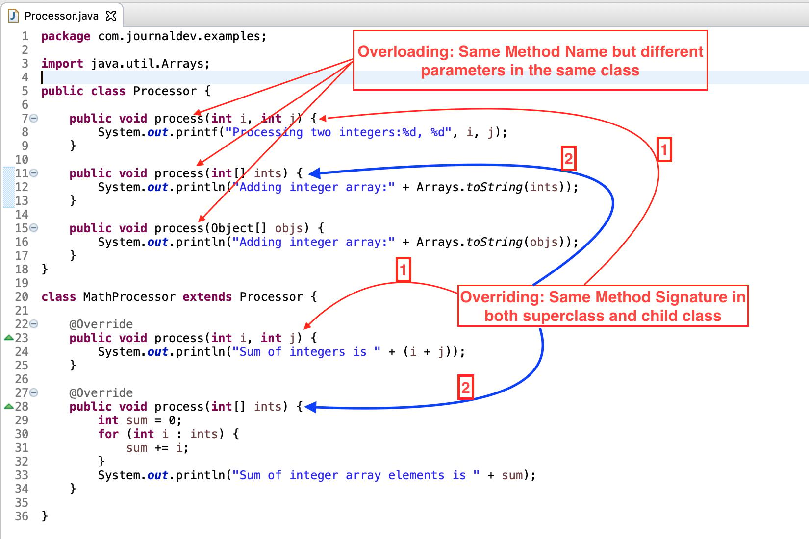

# Sobrecarga Vs Sobrescrita de Métodos

Entender a diferença entre **Overriding (Sobrescrita)** e **Overloading (Sobrecarga)** é essencial para dominar a Programação Orientada a Objetos (POO) em Java. Ambos são pilhas do **Polimorfismo**, mas funcionam em momentos e contextos completamente diferentes.

<p align="center">
  
  <p align="center">Captura de tela de código Java com setas apontando para instâncias onde a sobrecarga e a sobrescrita estão ocorrendo.</p>
</p>

Vamos analisar esses conceitos de forma prática e extremamente didática.

---

## O que é cada conceito?

* **Overloading (Sobrecarga):** É quando você tem métodos com o **mesmo nome** dentro da **mesma classe**, mas com **parâmetros diferentes** (muda a quantidade, o tipo ou a ordem dos argumentos). O compilador decide qual método chamar com base no que você passa como argumento.
* **Overriding (Sobrescrita):** Ocorre em uma relação de herança. A classe filha herda um método da classe mãe (superclasse) e decide **reescrever** esse método para mudar ou especializar o seu comportamento. A assinatura (nome e parâmetros) deve ser idêntica.

---

## Comparativo Direto: Overriding vs Overloading

| Característica | Overriding (Sobrescrita) | Overloading (Sobrecarga) |
| --- | --- | --- |
| **Tipo de Polimorfismo** | Polimorfismo de **Tempo de Execução** (Dinâmico) | Polimorfismo de **Tempo de Compilação** (Estático) |
| **Resolução** | O Java decide qual método executar na hora em que o programa roda, olhando para o **objeto real** criado na memória. | O compilador decide qual método usar na hora de compilar, olhando para os **argumentos passados**. |
| **Onde ocorre?** | Obrigatoriamente entre **classes diferentes** (Superclasse e Subclasse). | Na **mesma classe** (ou herdados, mas modificando apenas os parâmetros). |
| **Assinatura** | **Idêntica:** mesmo nome, mesmos parâmetros e mesmo tipo de retorno (ou compatível). | **Diferente:** mesmo nome, mas **parâmetros obrigatoriamente diferentes**. |
| **Tratamento de Erros** | Se houver erro de lógica na substituição, você só descobrirá quando o código rodar. | Se os parâmetros não baterem, o compilador acusa o erro imediatamente. |

---

## Exemplo Prático Comentado

Veja o código abaixo. Ele demonstra os dois conceitos aplicados. Preste atenção nos comentários inline para entender o papel de cada linha:

```java
package com.journaldev.examples;
import java.util.Arrays;

// Classe base (Superclasse) que demonstra o uso de Overloading (Sobrecarga)
public class Processor {

    // Método original: processa dois números inteiros isolados
    public void process(int i, int j) {
        // Imprime os dois inteiros formatados na tela
        System.out.printf("Processing two integers:%d, %d", i, j);
    }

    // SOBRECARGA 1: Mesmo nome 'process', mas agora aceita um array de inteiros (int[])
    public void process(int[] ints) {
        // Imprime o array convertido em texto simples
        System.out.println("Adding integer array:" + Arrays.toString(ints));
    }

    // SOBRECARGA 2: Mesmo nome 'process', mas agora aceita um array de Objetos genéricos (Object[])
    public void process(Object[] objs) {
        // Imprime o array de objetos na tela
        System.out.println("Adding integer array:" + Arrays.toString(objs));
    }
}

// Classe filha (Subclasse) que herda de Processor e demonstra Overriding (Sobrescrita)
class MathProcessor extends Processor {

    // SOBRESCRITA 1: Altera o comportamento do método process(int, int) da classe mãe
    @Override // Anotação opcional, mas boa prática para garantir que você está sobrescrevendo corretamente
    public void process(int i, int j) {
        // Em vez de apenas imprimir os números, esta versão especializada exibe a soma deles
        System.out.println("Sum of integers is " + (i + j));
    }

    // SOBRESCRITA 2: Altera o comportamento do método process(int[]) da classe mãe
    @Override
    public void process(int[] ints) {
        int sum = 0; // Variável acumuladora para a soma dos elementos
        
        // Loop 'for-each' que percorre cada número dentro do array recebido
        for (int i : ints) {
            sum += i; // Soma o valor atual ao total acumulado
        }
        // Exibe o resultado final da soma dos elementos do array
        System.out.println("Sum of integer array elements is " + sum);
    }
}

```

---

## Analisando os Blocos Isoladamente

### Isolando o conceito de Overriding (Sobrescrita)

Abaixo vemos como a classe filha `MathProcessor` captura a estrutura definida pela classe pai `Processor` e dá a ela uma nova utilidade:

```java
// Estrutura na classe Pai
public class Processor {
    // Define a assinatura: precisa receber dois parâmetros 'int'
    public void process(int i, int j) { /* Comportamento padrão da classe mãe */ }
}

// Estrutura na classe Filha (Especialização)
class MathProcessor extends Processor {
    @Override // Indica explicitamente ao compilador que este método substitui o da classe mãe
    // A assinatura é idêntica: mesmo nome 'process', mesmos tipos 'int i, int j'
    public void process(int i, int j) { /* Novo comportamento customizado para matemática */ }
}

```

E o mesmo acontece com o método que processa arrays de inteiros:

```java
// Estrutura na classe Pai
public class Processor {
    // Define a assinatura: precisa receber um array do tipo 'int[]'
    public void process(int[] ints) { /* Comportamento padrão da classe mãe */ }
}

// Estrutura na classe Filha
class MathProcessor extends Processor {
    @Override // Avisa o compilador sobre a substituição do comportamento
    // Assinatura idêntica: mesmo nome e mesmo parâmetro 'int[] ints'
    public void process(int[] ints) { /* Novo comportamento focado em somar o array */ }
}

```

### Isolando o conceito de Overloading (Sobrecarga)

Note que, dentro da própria classe `Processor`, o método `process` foi escrito três vezes. O que muda de um para o outro? Apenas os **argumentos de entrada**:

```java
public class Processor {
    // Versão 1: Aceita dois inteiros simples primitivos
    public void process( int i, int j ) { /* ... */ }
    
    // Versão 2: Aceita uma lista/array de inteiros primitivos
    public void process( int[] ints ) { /* ... */ }
    
    // Versão 3: Aceita uma lista/array de Objetos estruturados
    public void process( Object[] objs ) { /* ... */ }
}

```

> **Resumo Didático:** > Pense na **Sobrecarga (Overloading)** como uma ferramenta multiuso que sabe lidar com diferentes materiais (parâmetros). Pense na **Sobrescrita (Overriding)** como uma herança onde o filho decide fazer a mesma tarefa que o pai fazia, mas do seu próprio jeito.