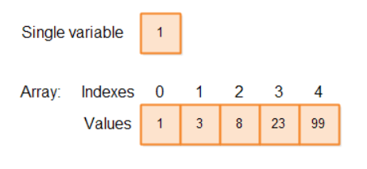

# Arrays

Um **Array** (ou vetor) em Java é uma estrutura de dados utilizada para armazenar uma **coleção de variáveis do mesmo tipo**. Imagine o array como uma fileira de caixas numeradas em um armário, onde cada caixa guarda um valor.

<p align="center">
  
</p>


Os arrays em Java possuem duas características fundamentais:

1. **Homogêneos:** Armazenam apenas dados de um único tipo (por exemplo, apenas números inteiros, ou apenas textos).
2. **Ordenados por Índices:** Cada caixa possui uma posição fixa chamada **índice**, que sempre começa no número **0**.

---

## Declarando uma Variável de Array

Declarar um array é como avisar ao Java que você pretende criar esse "armário" no futuro. A sintaxe básica consiste em colocar colchetes `[]` junto ao tipo de dado.

```java
// Declara um array de números inteiros chamado 'intArray'
int[] intArray; 

```

Você pode usar arrays em qualquer lugar onde usaria uma variável comum: como atributos de uma classe (campos), variáveis locais dentro de métodos ou parâmetros de funções.

```java
// Declara um array para armazenar textos (referências a objetos String)
String[] stringArray;

// Declara um array para armazenar objetos de uma classe personalizada criada por você
MyClass[] myClassArray;

```

### Onde colocar os colchetes?

O Java permite colocar os colchetes `[]` tanto após o **tipo** quanto após o **nome da variável**. Ambas as abordagens abaixo funcionam:

```java
int[] arrayFormaA; // Abordagem recomendada (o array faz parte do tipo de dado)
int arrayFormaB[]; // Abordagem alternativa (herdada da linguagem C)

String[] stringArrayA;
String stringArrayB[];

MyClass[] myClassArrayA;
MyClass myClassArrayB[];

```

> ⚠️ **Boa Prática:** Prefira sempre colocar os colchetes logo após o tipo de dado (ex: `int[] intArray`). Isso deixa claro logo na leitura que o tipo daquela variável é "um bloco de inteiros" e não um inteiro simples.

---

## Instanciando um Array em Java (Alocando Memória)

Apenas declarar a variável **não cria o array na memória**. A declaração cria apenas uma referência (um ponteiro vazio que aponta para `null`). Para de fato reservar o espaço físico das caixas no seu computador, usamos a palavra-chave `new`.

```java
int[] intArray;          // 1. Declaração: "Vou criar um ponteiro para um array de inteiros"
intArray = new int[10];  // 2. Instanciação: "Reserve espaço para exatamente 10 inteiros na memória"

```

### Arrays de Tipos Primitivos vs. Arrays de Objetos

O Java trata o conteúdo do seu array de duas formas diferentes, dependendo do tipo:

* **Tipos Primitivos (`int`, `double`, `boolean`, etc.):** O espaço reservado guarda os valores reais diretamente. Ao usar `new int[10]`, o Java preenche automaticamente todas as 10 caixas com o valor padrão `0`.
* **Referências a Objetos (`String`, `Carro`, etc.):** O array guarda apenas endereços de memória. Ao instanciar, todas as caixas começam com `null` (vazias), indicando que não apontam para nenhum objeto real ainda.

```java
// Cria um array de referências para Strings. Inicialmente, todas as 10 posições são 'null'.
String[] stringArray = new String[10];

```

---

## Literais de Array em Java

Se você já sabe quais valores deseja colocar dentro do seu array desde o início, você não precisa definir o tamanho manualmente e atribuir item por item. O Java oferece um atalho chamado **Literal de Array**:

```java
// Forma completa de criar um array já inicializado com valores
int[] ints2 = new int[]{ 1, 2, 3, 4, 5, 6, 7, 8, 9, 10 };

```

Nas versões modernas do Java, você pode encurtar ainda mais essa sintaxe omitindo o trecho `new int[]`:

```java
// Atalho moderno e mais limpo (o Java infere o tipo e o tamanho automaticamente)
int[] ints2 = { 1, 2, 3, 4, 5, 6, 7, 8, 9, 10 }; 

```

Essa facilidade funciona perfeitamente para qualquer tipo de dado, incluindo arrays de objetos como `String`:

```java
// Cria um array de String com tamanho 3, já preenchido com os textos
String[] strings = {"one", "two", "three"};

```

---

## O Tamanho do Array Não Pode Ser Alterado

> 🚨 **Regra de Ouro do Java:** Uma vez instanciado (criado), o tamanho de um array é **imutável**.

Se você criou um `new int[10]`, ele terá exatamente 10 posições até o fim de sua vida útil. Diferente de linguagens como JavaScript ou Python, onde os arrays crescem dinamicamente, em Java se você precisar de mais espaço, você terá que:

* Criar um novo array maior e copiar os elementos do antigo para o novo.
* Utilizar uma estrutura dinâmica da API do Java, como um `ArrayList`.

---

## Acessando Elementos de um Array

Para ler ou modificar o valor guardado dentro de uma "caixa" do array, usamos o número do seu **índice** dentro de colchetes.

```java
// Atribui o valor 0 à primeira posição do array (Índice 0)
intArray[0] = 0;

// Lê o valor guardado no índice 0 e o copia para a variável 'firstInt'
int firstInt = intArray[0];

```

Lembre-se sempre: se o tamanho do seu array é $N$, os índices válidos vão de $0$ até $N-1$.
Se você tentar acessar um índice fora desse limite (como o índice 10 em um array de tamanho 10), o Java interromperá seu programa lançando o famoso erro: `ArrayIndexOutOfBoundsException`.

---

## Tamanho do Array (`length`)

Qualquer array em Java possui uma propriedade interna chamada `length` que devolve a quantidade total de elementos que ele pode armazenar.

```java
int[] intArray = new int[10]; // Instancia um array com 10 posições

// A variável 'arrayLength' recebe o valor 10
int arrayLength = intArray.length; 

```

---

## Iterando Arrays (Percorrendo Elementos)

Para ler, exibir ou modificar todos os elementos de um array de ponta a ponta, utilizamos estruturas de repetição (laços).

### 1. Laço `for` Tradicional

É a escolha ideal quando você **precisa do número do índice** durante a execução do loop (seja para modificar o valor ou para usar o próprio índice na lógica).

```java
// Cria um array de String com 10 posições (todas começam como null)
String[] stringArray = new String[10];

// Primeiro Loop: Usa o índice 'i' para preencher cada gaveta com um texto customizado
for(int i = 0; i < stringArray.length; i++) {
    stringArray[i] = "String no " + i; // Atribui, ex: "String no 0", "String no 1"...
}

// Segundo Loop: Percorre o array novamente, apenas para imprimir os valores no console
for(int i = 0; i < stringArray.length; i++) {
    System.out.println(stringArray[i]); // Imprime o texto contido na posição 'i'
}

```

Veja o mesmo exemplo aplicado a um array de inteiros primitivos:

```java
int[] intArray = new int[10]; // Cria um array de 10 inteiros

// Loop de preenchimento: grava o valor do próprio índice dentro de cada caixa
for(int i = 0; i < intArray.length; i++) {
    intArray[i] = i; // Índice 0 recebe 0, índice 1 recebe 1...
}

// Loop de leitura: exibe os números na tela
for(int i = 0; i < intArray.length; i++) {
    System.out.println(intArray[i]);
}

```

### 2. Laço `for-each` (Enhanced for)

Uma sintaxe muito mais limpa introduzida para quando você **apenas precisa ler os valores**, sem se importar com a posição/índice de cada um.

```java
int[] intArray = new int[10]; // Cria um array de 10 inteiros

// Lê cada elemento sequencialmente. O valor atual é copiado para a variável 'theInt'
for(int theInt : intArray) {
    System.out.println(theInt); // Apenas exibe o valor (não permite alterar o array original)
}

```

O `for-each` também funciona perfeitamente com objetos:

```java
String[] stringArray = {"one", "two", "three"}; // Array inicializado com 3 textos

// A cada rodada, 'theString' assume o valor de uma das palavras do array
for(String theString : stringArray) {
    System.out.println(theString); // Imprime "one", depois "two", depois "three"
}

```

---

## Arrays Multidimensionais em Java

Até agora vimos tabelas de uma linha só (unidimensionais). Um array multidimensional é, na verdade, **um array de arrays**. O tipo mais comum é o bidimensional (matriz), que simula uma tabela com linhas e colunas.

Para adicionar dimensões, basta adicionar mais pares de colchetes `[][]`.

```java
// Cria uma matriz (tabela) de inteiros com 10 linhas e 20 colunas
int[][] intArray = new int[10][20];

```

Visualmente, o Java cria um grande array principal com 10 posições, e dentro de cada uma dessas posições existe outro array completo com 20 elementos inteiros.

Para acessar ou modificar dados em matrizes, você deve fornecer as coordenadas de **linha** e **coluna** do elemento desejado:

```java
int[][] intArray = new int[10][20]; // Inicializa a matriz

intArray[0][2] = 129; // Grava o número 129 na linha 0, coluna 2

int oneInt = intArray[0][2]; // Lê o valor da linha 0, coluna 2 e salva em 'oneInt'

```

### Iterando Arrays Multidimensionais

Para percorrer uma matriz bidimensional por completo, precisamos de um **laço for aninhado** (um `for` dentro do outro). O primeiro laço percorre as linhas e o segundo percorre as colunas daquela linha específica.

```java
int[][] intArray = new int[10][20]; // Cria a estrutura da matriz

// O laço externo percorre cada uma das 10 linhas (i)
for(int i = 0; i < intArray.length; i++){
    // O laço interno percorre as 20 colunas (j) da linha atual (intArray[i])
    for(int j = 0; j < intArray[i].length; j++){
        System.out.println("Linha i: " + i + ", Coluna j: " + j);
    }
}

```

---

## Inserindo Elementos em um Array

Como o tamanho do array é fixo, se você quiser "inserir" um elemento no meio dele, terá que "empurrar" manualmente todos os elementos seguintes uma casa para o lado, abrindo um espaço vazio para o novo valor. Note que o último elemento do array acabará sendo "empurrado para fora" e será perdido.

```java
int[] ints = new int[20]; // Cria um array de tamanho 20

int insertIndex = 10;     // Define que queremos inserir na posição (índice) 10
int newValue    = 123;    // O novo valor que será inserido

// Loop invertido: começa do final do array e move cada elemento para a direita
for(int i = ints.length - 1; i > insertIndex; i--){
    ints[i] = ints[i-1];  // O elemento da esquerda é copiado para a direita
}

ints[insertIndex] = newValue; // Com o espaço aberto, o novo valor é inserido no índice 10

// Converte o array em texto legível e o imprime
System.out.println(Arrays.toString(ints)); 

```

Podemos transformar essa lógica em um método utilitário reutilizável:

```java
// Método que automatiza o processo de inserção recebendo o array alvo, o índice e o valor
public void insertIntoArray(int[] array, int insertIndex, int newValue){
    // Desloca os elementos para a direita de trás para frente para não sobrescrever os dados
    for(int i = array.length - 1; i > insertIndex; i--){
        array[i] = array[i-1]; // Move o elemento uma posição para frente
    }
    
    array[insertIndex] = newValue; // Insere o valor desejado na vaga liberada
}

```

Para usar este método, bastaria chamá-lo passando as variáveis necessárias:

```java
int[] ints = new int[20]; // Cria o array base

// Exemplo de chamadas consecutivas para preencher posições específicas deslocando o resto
insertIntoArray(ints, 0, 10); // Insere 10 no índice 0
insertIntoArray(ints, 1, 23); // Insere 23 no índice 1
insertIntoArray(ints, 9, 67); // Insere 67 no índice 9

```

---

## Removendo Elementos de um Array

A remoção de um elemento funciona de maneira inversa à inserção. Quando queremos apagar um item do meio do array, precisamos puxar todos os elementos que estão à direita dele uma posição para a esquerda. Isso sobrescreve (apaga) o valor indesejado. No final do processo, a última posição do array ficará duplicada.

```java
int[] ints = new int[20]; // Cria um array com 20 posições

ints[10] = 123;           // Coloca o valor 123 no índice 10 apenas como teste
int removeIndex = 10;     // Define que queremos remover o elemento do índice 10

// O loop começa a partir do índice removido e caminha até o penúltimo elemento
for(int i = removeIndex; i < ints.length - 1; i++){
    ints[i] = ints[i + 1]; // Puxa o elemento da direita para a esquerda
}
// Resultado: O elemento do índice 10 sumiu, e o valor do índice 19 agora está repetido no 18 e 19.

```